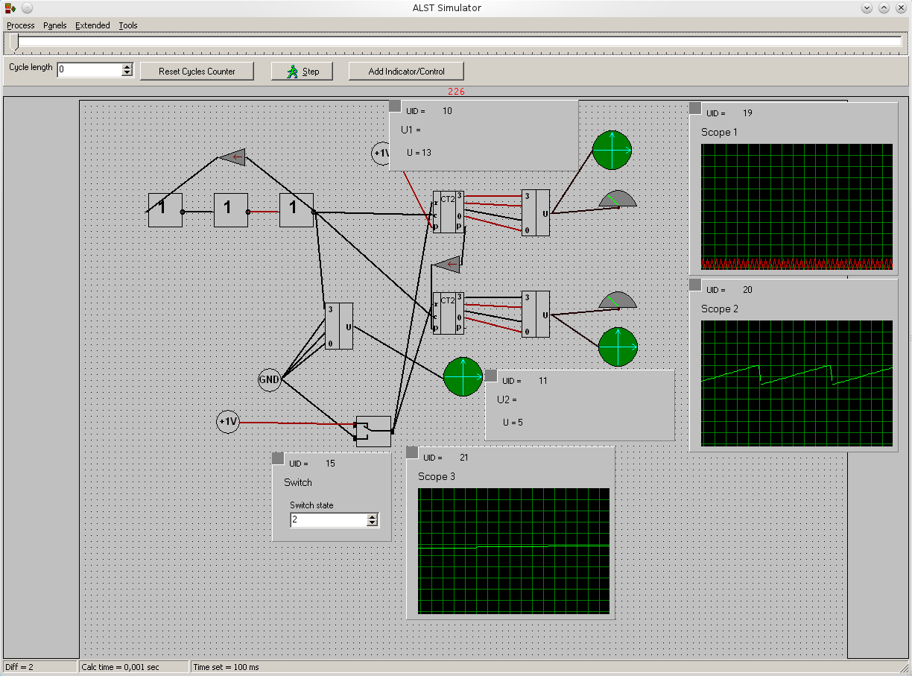
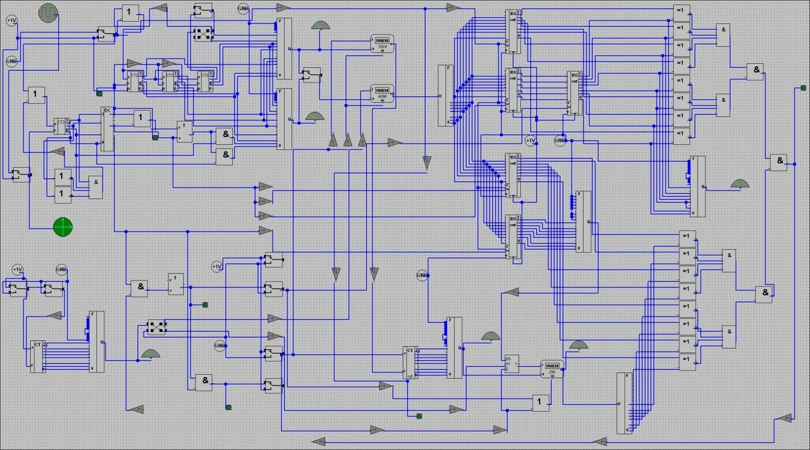

# Alternative Logic Set (ALST)
ALST is a computer-aided non-binary logic research, design and simulation system (which can also simulate binary logic).
In essence, ALST is a CAD for all imaginable logic systems (binary, ternary, etc) which allows you to create your own basic components, create schemes utilizing those components, and then simulate their behavior with various types of stimuli.

ALST provides rich functionality to create and maintain a component library using user-created elements; analyze and simulate complete systems.
This CAD was used by me and some close colleagues of mine for the last 17 years to develop new system designs and architectures.
Nearly all of my hardware projects were prototyped in ALST first.

The system provides an intuitive workflow, where user can easily start a simulation, detect a bug, fix it, and continue the simulation from exactly the last saved point.
It's just as easy as setting a wire or removing an IC from a breadboard.

You can easily create interactive systems as well as purely batch-processing ones.

ALST works well on almost any machine: from old P1-90 with 32MB of RAM and Windows 95, all the way up to modern Windows 11 PCs.
It also works perfectly well in any \*nix system which has WINE: from FreeBSD to Ubuntu.
You can even run ALST in DosBox on your palm-top game machine using HX Dos Extender.
It's safe to say that if you can run vanilla DOOM on something, you can run ALST on the same thing :)

**This document is WIP. More updates will come soon.**

## Some examples

### Simple oscillator and counters

### Small CPU

### Old project location
[old location at SourceForge](https://sourceforge.net/projects/alst)
